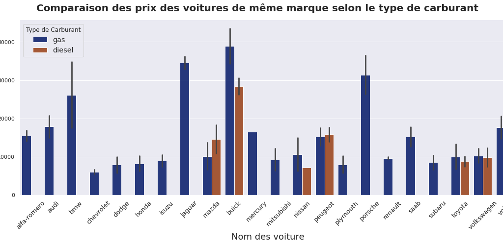
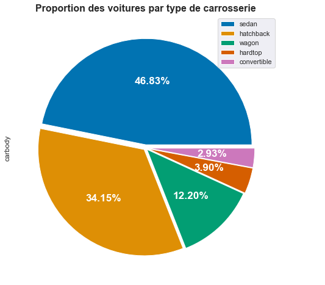

# Data Visualisation
L’un des processus de la data science est la visualisation des données. Elle permet de comprendre comment les variables sont distribuées et nous donne une idée claire de ce que signifie l’information,  en lui donnant un contexte visuel à travers des cartes ou des graphiques.

Il existe plusieurs types de format graphique pour la visualisation des données.

Certains des types les plus courants sont:
* Bar Chart
* Pie Chart
* Stacked Area Chart
* Line Chart
* Histogram
* Scatter Plot
* Regression Plot

## Bar Chart

## Pie Chart

Vous trouverez des tutoriels sur les types de format graphique pour la visualisation des données [ici](https://blog.sinatechnologie.com/graphique-a-barres)
